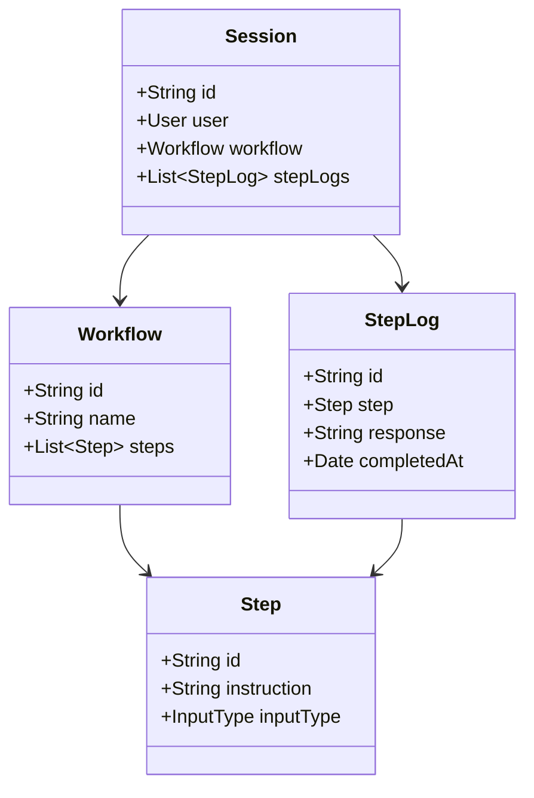
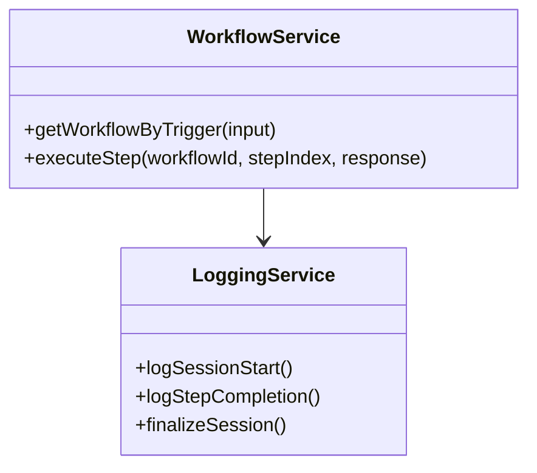

# Class Diagrams

## Core Domain Model

```mermaid
classDiagram
    class Workflow {
        +String id
        +String name
        +List~Step~ steps
    }

    class Step {
        +String id
        +String instruction
        +InputType inputType
    }

    class Session {
        +String id
        +User user
        +Workflow workflow
        +List~StepLog~ stepLogs
    }

    class StepLog {
        +String id
        +Step step
        +String response
        +Date completedAt
    }

    Workflow --> Step
    Session --> Workflow
    Session --> StepLog
    StepLog --> Step
```

## Service Layer

```mermaid
classDiagram
    class WorkflowService {
        +getWorkflowByTrigger(input)
        +executeStep(workflowId, stepIndex, response)
    }

    class LoggingService {
        +logSessionStart()
        +logStepCompletion()
        +finalizeSession()
    }

    WorkflowService --> LoggingService
```
