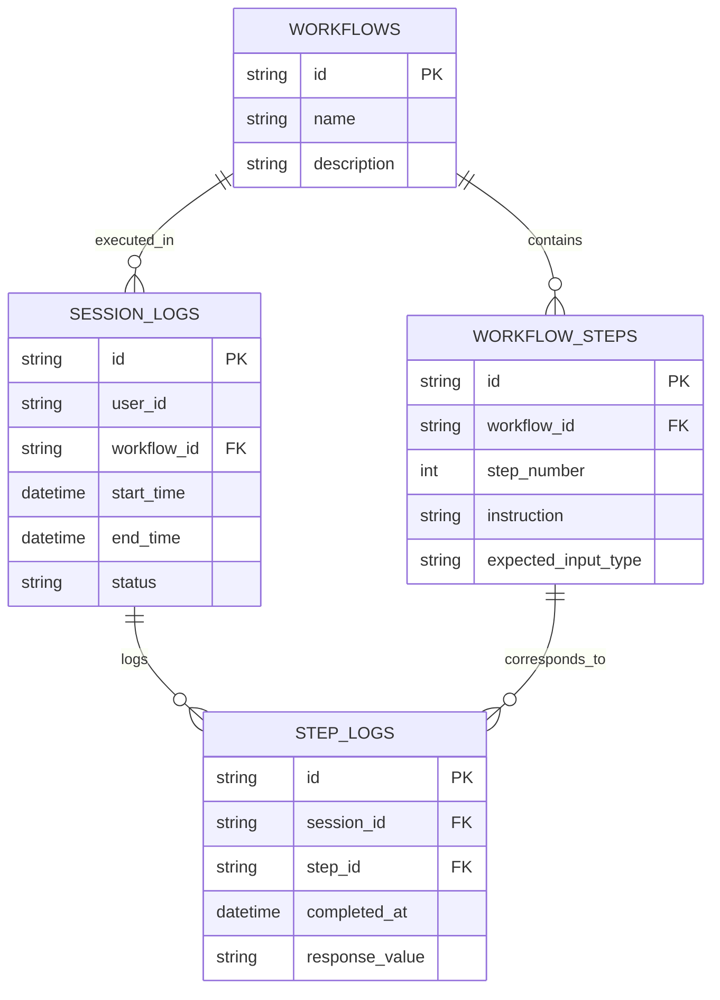

# Entity Relationship Diagram (ERD)

## Overview

This diagram models the relational structure of workflow execution and logging.

```mermaid
erDiagram
    WORKFLOWS ||--o{ WORKFLOW_STEPS : contains
    WORKFLOWS ||--o{ SESSION_LOGS : executed_in
    SESSION_LOGS ||--o{ STEP_LOGS : logs
    WORKFLOW_STEPS ||--o{ STEP_LOGS : corresponds_to

    WORKFLOWS {
        string id PK
        string name
        string description
    }

    WORKFLOW_STEPS {
        string id PK
        string workflow_id FK
        int step_number
        string instruction
        string expected_input_type
    }

    SESSION_LOGS {
        string id PK
        string user_id
        string workflow_id FK
        datetime start_time
        datetime end_time
        string status
    }

    STEP_LOGS {
        string id PK
        string session_id FK
        string step_id FK
        datetime completed_at
        string response_value
    }
```
