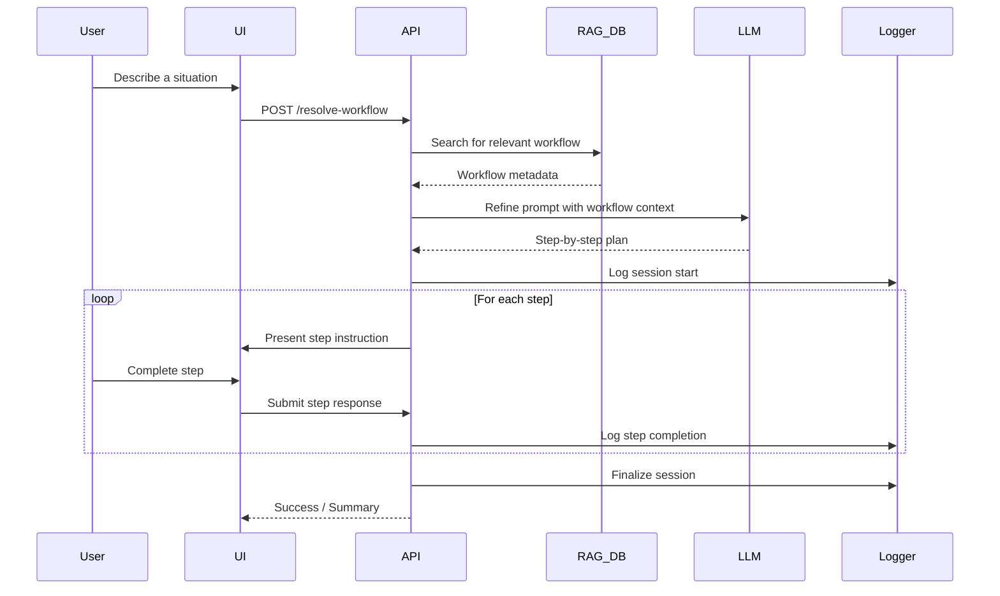

# Sequence Diagram: Workflow Execution

## Overview

This diagram illustrates how a workflow is selected and executed through the system.

```mermaid
sequenceDiagram
    participant User
    participant UI
    participant API
    participant RAG_DB
    participant LLM
    participant Logger

    User->>UI: Describe a situation
    UI->>API: POST /resolve-workflow
    API->>RAG_DB: Search for relevant workflow
    RAG_DB-->>API: Workflow metadata
    API->>LLM: Refine prompt with workflow context
    LLM-->>API: Step-by-step plan
    API->>Logger: Log session start
    loop For each step
        API->>UI: Present step instruction
        User->>UI: Complete step
        UI->>API: Submit step response
        API->>Logger: Log step completion
    end
    API->>Logger: Finalize session
    API-->>UI: Success / Summary
```
